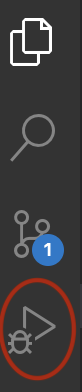
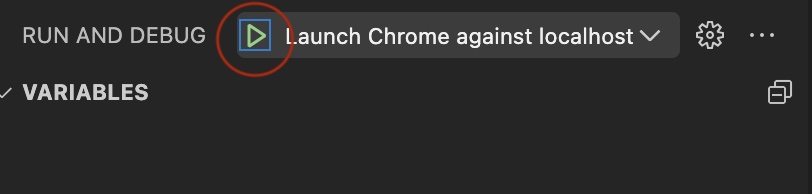
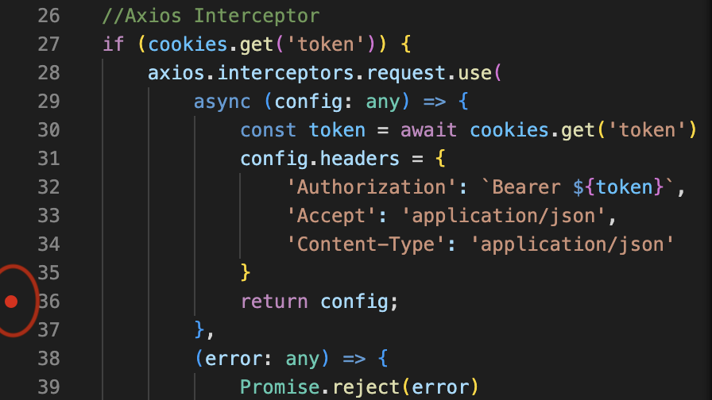

### Debugging
**NOTE:** Debugging does not work in devspaces as of now. It can only be done on VS Code locally.

You can find a `launch.json` file in the `.vscode` folder. 
1. Open a TSX component file and click on the 'Run and Debug' pane in VS Code. 

2. Choose chrome Run the debugger(the green button on top).

3. Set breakpoints in your code and it will be executed only upto those points in the launched browser window. 

You can now view variable values and the call stack at this point.
